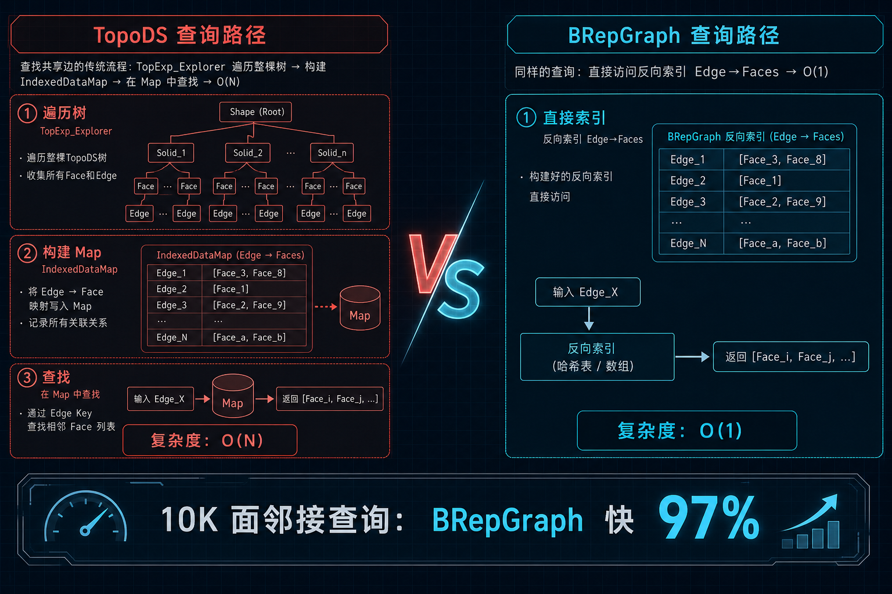
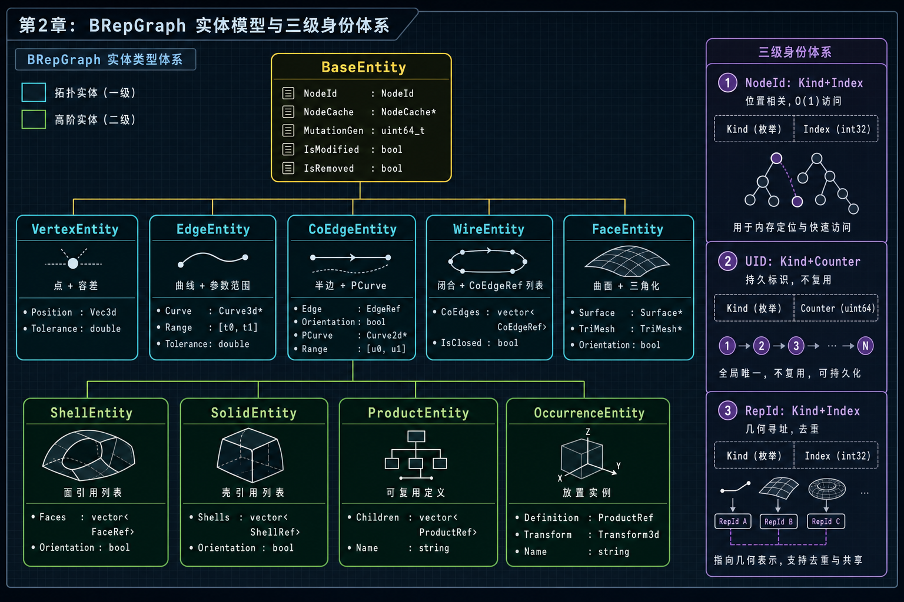
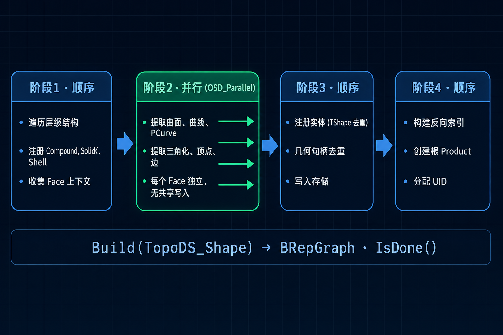
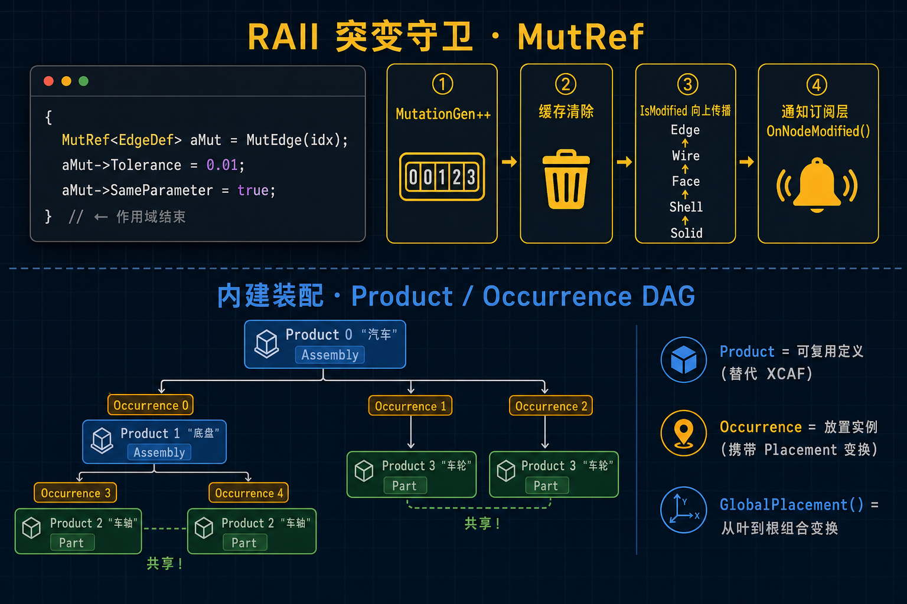
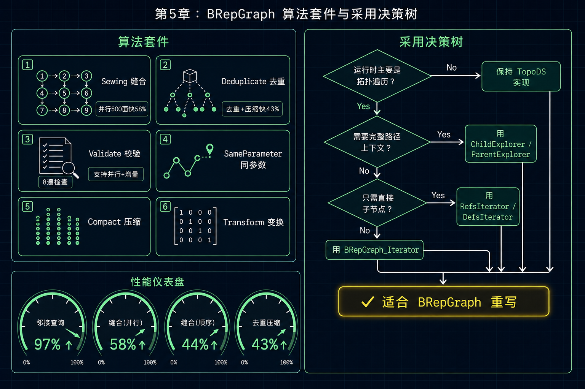

# OCCT 8.0 BRepGraph：新一代拓扑-几何图模型入门

> 当你的 CAD 算法花 80% 时间在遍历拓扑、构建邻接表，只有 20% 时间在做真正的几何计算——是时候换一种数据结构了。

## 这篇教程能给你什么

读完这篇教程，你将能够：

1. 理解 BRepGraph 解决了 TopoDS/BRep 模型的哪些结构性瓶颈
2. 掌握 BRepGraph 的实体模型、三级身份体系和 CoEdge 半边设计
3. 用 BRepGraph API 完成邻接查询、几何访问和突变操作
4. 评估在你的项目中采用 BRepGraph 的时机和策略

**前置知识**：你应该了解 TopoDS_Shape 层次结构（Solid→Shell→Face→Wire→Edge→Vertex）和 BRep_Tool 的基本用法。

---

## 第1章 TopoDS 的结构性瓶颈

### 1.1 一个真实场景：查找共享边

假设你正在写一个形状分析算法，需要找出两个面之间的共享边。在当前的 TopoDS 模型中，你需要这样做：

```cpp
TopTools_IndexedDataMapOfShapeListOfShape aEdgeFaceMap;
TopExp::MapShapesAndAncestors(aShape, TopAbs_EDGE, TopAbs_FACE, aEdgeFaceMap);
// 遍历整个 Map，找到同时属于 FaceA 和 FaceB 的边
```

这段代码的问题不在于写法——而在于 **每次查询都要遍历整棵拓扑树来构建 Map，复杂度 O(N)**。对于包含 10,000 个面的模型，这意味着每次查询都要重新走一遍全部拓扑。



### 1.2 三个核心痛点

TopoDS 模型服务了 25 年，但对于现代算法有三个结构性限制：

| 痛点 | 根因 | 后果 |
|---|---|---|
| **邻接查询慢** | 拓扑是树，不是图。反向查询（边→面）需要构建临时 Map | O(N) 遍历 + 哈希表开销 |
| **身份基于指针** | `TShape` 指针相等 = 同一实体。无法序列化、压缩、跨会话追踪 | 不支持持久化标识 |
| **PCurve 查找脆弱** | `BRep_Tool::CurveOnSurface` 遍历 CurveRepresentation 列表，匹配 Surface + Location | 对 Location 结构敏感，平面曲面可能即时计算 |

> **要注意的是**：这些不是 bug，而是设计约束。TopoDS 的灵活性来自它的树形结构，但灵活性的代价是查询效率。

### 1.3 检查点

在继续之前，确认你能回答：TopoDS 中，从一条边找到它所属的所有面，需要几步操作？（答案：至少两步——构建 Map + 查找）

---

## 第2章 BRepGraph 实体模型与三级身份

### 2.1 从遍历树到索引图

BRepGraph 不替代 TopoDS——它提供一个 **索引图视图**，从 `TopoDS_Shape` 构建，可以转换回来。

核心变化：每种拓扑元素（顶点、边、面等）在对应向量中 **恰好存在一次**。父子关系存储为轻量级引用结构体（VertexRef、CoEdgeRef、WireRef、FaceRef、ShellRef），携带方向和位置。

反向索引提供 O(1) 的上溯导航：

```cpp
// BRepGraph：直接反向索引查找
const NCollection_Vector<int>& aFaces = aSpatial.FacesOfEdgeRef(anEdgeIdx);
// 立即得到 Edge 所属的所有 Face，无需构建 Map
```

### 2.2 九种实体类型

BRepGraph 定义了完整的实体类型体系，每种继承自 BaseEntity：



**拓扑实体**（5种）：

- **VertexEntity**：3D 点 + 容差
- **EdgeEntity**：3D 曲线 + 参数范围 + 起止顶点引用
- **CoEdgeEntity**（新增）：半边，直接持有 PCurve、UV 端点、Seam 配对
- **WireEntity**：CoEdgeRef 列表 + 闭合标志
- **FaceEntity**：曲面 + 三角化 + WireRef 列表

**高阶实体**（4种）：

- **ShellEntity** / **SolidEntity**：常规拓扑容器
- **ProductEntity**（新增）：可复用的形状定义（替代 XCAF）
- **OccurrenceEntity**（新增）：放置实例，携带变换矩阵

### 2.3 三级身份体系

这是 BRepGraph 最精巧的设计之一——三种标识各有适用场景：

| 身份 | 组成 | 大小 | 特性 | 适用场景 |
|---|---|---|---|---|
| **NodeId** | Kind + Index | 8 字节 | 位置相关，O(1) 访问 | 内部遍历和快速引用 |
| **UID** | Kind + Counter | 8 字节 | 持久标识，Counter 单调递增不复用 | 跨会话追踪、历史记录 |
| **RepId** | Kind + Index | 8 字节 | 几何/网格寻址 | 曲面、曲线去重共享 |

> **常见陷阱**：不要把 NodeId 当作持久标识。Compact 操作会重排索引，只有 UID 保证在压缩、删除、图变换后仍然有效。

### 2.4 检查点

CoEdge 实体解决了 BRep_Tool 的什么问题？（答案：PCurve 由 CoEdge 直接持有，不再需要遍历 CurveRepresentation 列表匹配 Surface + Location）

---

## 第3章 Build 管线与 API 视图

### 3.1 四阶段构建管线

将 `TopoDS_Shape` 转换为 BRepGraph 是一个多阶段管线：



```cpp
BRepGraph aGraph;
aGraph.Build(BRepPrimAPI_MakeBox(10, 20, 30).Shape());
// 6 面、12 边、8 顶点，全部索引化
```

关键是 **阶段2 的并行化**：每个 Face 的几何提取（曲面、曲线、PCurve、三角化、顶点）独立进行，使用 `OSD_Parallel`。提取的数据纯局部，无共享写入。阶段3 再顺序注册，用 TShape 指针和几何句柄进行去重。

### 3.2 八种 API 视图

BRepGraph 的接口按职责分组为轻量级视图：

| 视图 | 用途 | 关键方法 |
|---|---|---|
| `Defs()` | 读实体定义 | `NbFaces()`, `Edge(idx)`, `FaceCountOfEdge(idx)` |
| `UIDs()` | 持久身份 | `Of(nodeId)`, `NodeIdFrom(uid)` |
| `Spatial()` | 邻接和位置 | `FacesOfEdge(idx)`, `GlobalPlacement(occIdx)` |
| `Shapes()` | 重建 TopoDS | `Node(nodeId)`, `FaceWithCache(idx, cache)` |
| `Mut()` | 可变定义 | `EdgeDef(idx)`, `SplitEdge(idx, param)` |
| `Builder()` | 图构建 | `AddProduct(root)`, `AddOccurrence(parent, ref, loc)` |
| `Attrs()` | 节点缓存属性 | `Get(nodeId, key)`, `Set(nodeId, key, attr)` |
| `Analyze()` | 分解分析 | `Decompose()`, `AreEdgesCompatible(...)` |

### 3.3 几何访问：告别 BRep_Tool

```cpp
// 直接访问，无需 TopExp_Explorer + BRep_Tool
const gp_Pnt aPnt = BRepGraph_Tool::Vertex::Pnt(aGraph, aVertexIdx);
const occ::handle<Geom_Surface>& aSurf = BRepGraph_Tool::Face::Surface(aGraph, aFaceIdx);
const occ::handle<Geom2d_Curve>& aPCurve = BRepGraph_Tool::CoEdge::PCurve(aGraph, aCoEdgeIdx);
```

> **要注意的是**：`BRepGraph_Tool` 按拓扑类型组织（`Vertex::`、`Edge::`、`CoEdge::`、`Face::`），每种提供完整的几何访问方法。

### 3.4 检查点

Build 管线的哪个阶段支持并行？它为什么能并行？（答案：阶段2，因为每个 Face 的几何提取完全独立，无共享写入）

---

## 第4章 RAII 突变与装配原生



### 4.1 作用域突变守卫

传统 `BRep_Builder` 修改拓扑是临时的——没有内建的变更追踪、缓存失效或传播机制。BRepGraph 的 `MutRef` 用 RAII 自动处理：

```cpp
{
  BRepGraph_MutRef<BRepGraph_TopoNode::EdgeDef> aMutEdge = aGraph.MutEdge(anEdgeIdx);
  aMutEdge->Tolerance = 0.01;
  aMutEdge->SameParameter = true;
  aMutEdge->SameRange = true;
}
// 作用域结束时自动：
// 1. MutationGen 递增
// 2. 重建缓存清除
// 3. IsModified 向上传播到父 Wire/Face/Shell/Solid
// 4. 通知订阅层 OnNodeModified()
```

对于批量操作，**延迟失效模式** 累积变更后一次性刷新，消除并行循环中的逐实体锁竞争。

### 4.2 内建装配：Product 与 Occurrence

传统 OCCT 中，装配结构在 XCAF 层，与拓扑分离。BRepGraph 让装配成为一等公民：

- **ProductEntity**：可复用的形状定义（相当于 STEP 中的 product_definition）
- **OccurrenceEntity**：放置实例，携带变换矩阵（相当于 STEP 中的 next_assembly_usage_occurrence）

```cpp
// 每次 Build() 自动创建根 Product
// 简单 Box → 一个 Product，ShapeRootId = Solid(0)
// 多级装配 → Product-Occurrence DAG
const auto aPlacement = aSpatial.GlobalPlacement(anOccIdx);
// 从叶到根组合变换矩阵
```

> **常见陷阱**：不要混淆 Product 和 Solid。一个 Product 可以包含多个 Solid（通过 Occurrence 引用其他 Product），而一个 Solid 只是拓扑实体。

### 4.3 检查点

MutRef 的 RAII 守卫在作用域结束时会做哪四件事？

---

## 第5章 算法套件与采用策略



### 5.1 图原生算法

BRepGraph 附带一组直接在图上运行的算法：

| 算法 | 功能 | 关键特性 |
|---|---|---|
| **Sewing** | 9阶段管线：自由边检测→顶点装配→边切割→KDTree候选→几何匹配→边合并 | 并行500面快58% |
| **Deduplicate** | KDTree 顶点去重 + 容差感知合并 | 去重+压缩快43% |
| **SameParameter** | 容差强制 + 常见曲面/曲线对的解析快速路径 | — |
| **Validate** | 8遍结构不变式检查 | 支持并行、增量检查 |
| **Compact** | 移除软删除实体，重建密集向量，重映射交叉引用 | — |
| **Transform** | 图级变换（就地几何变换或仅位置） | — |

### 5.2 性能基准（Apple M4, 10核, 16GB）

| 操作 | vs 基线 |
|---|---|
| 空间邻接查询（10K 面） | **97% 更快** |
| 缝合 500 面（并行） | **58% 更快** |
| 缝合 500 面（顺序） | **44% 更快** |
| 去重 + 压缩（500 副本） | **43% 更快** |

关键因素：bump-pointer 分配器、密集向量反向索引、延迟失效的并行突变、KDTree 候选检测。

### 5.3 何时该用 BRepGraph

用下面的决策树判断你的算法是否适合迁移：

1. **运行时间是否由拓扑遍历或邻接查询主导？** → 不是 → 保持 TopoDS
2. **是否需要完整的路径上下文（位置/方向）？** → 是 → 用 ChildExplorer / ParentExplorer
3. **是否只需要单个父节点的直接子节点？** → 是 → 用 RefsIterator / DefsIterator
4. **其他情况** → 用 BRepGraph_Iterator

> **要注意的是**：不要机械地把每个 `TopExp_Explorer` 替换成 BRepGraph 调用。真正的收益来自消除重复的形状探索和临时 Map 构建，而不仅仅是换循环语法。

### 5.4 快速上手

```cpp
#include <BRepGraph.hxx>
#include <BRepGraph_Tool.hxx>
#include <BRepPrimAPI_MakeBox.hxx>

BRepGraph aGraph;
aGraph.Build(BRepPrimAPI_MakeBox(10, 20, 30).Shape());

const int aNbFaces = aGraph.Defs().NbFaces();       // 6
const int aFaceCount = aGraph.Defs().FaceCountOfEdge(0); // 2

const occ::handle<Geom_Surface>& aSurface =
  BRepGraph_Tool::Face::Surface(aGraph, 0);

const TopoDS_Shape aFace =
  aGraph.Shapes().Node(BRepGraph_NodeId::Face(0));
```

### 5.5 练习

1. **识别练习**：在你当前的项目中，找出所有使用 `TopExp::MapShapesAndAncestors` 的地方。哪些可以用 BRepGraph 的反向索引替代？
2. **转换练习**：选一个简单的邻接查询（如"找出一条边的两个相邻面"），分别用 TopoDS 和 BRepGraph 实现，对比代码量和可读性。
3. **反思练习**：BRepGraph 的 UID 机制解决了你项目中的哪些"身份追踪"问题？如果你的算法需要在多次修改后仍然追踪同一条边，TopoDS 能做到吗？

---

---

## 第6章 源码解读：从实际 API 理解 BRepGraph

> 以下代码示例直接来自 OCCT 8.0 源码 `src/ModelingData/TKBRep/BRepGraph/` 和 `BRepGraphInc/`。

### 6.1 BRepGraph 核心类（BRepGraph.hxx）

`BRepGraph` 类是整个图模型的入口。它的 API 通过"分组视图"组织：

```cpp
// 源码：BRepGraph.hxx，第 92-177 行
class BRepGraph
{
public:
  // 构建图
  void Build(const TopoDS_Shape& theShape, const bool theParallel = false);
  bool IsDone() const;

  // 六大分组视图（Grouped View API）
  const TopoView&   Topo()   const;  // 拓扑定义 + 邻接
  const UIDsView&   UIDs()   const;  // 持久身份
  CacheView&        Cache();          // 瞬态缓存
  const RefsView&   Refs()   const;  // 引用条目
  const ShapesView& Shapes() const;  // 重建 TopoDS
  BuilderView&      Builder();        // 构建 + 突变

  // 历史与层
  BRepGraph_History&      History();
  BRepGraph_LayerRegistry& LayerRegistry();
};
```

注意 `Build()` 有两个重载：默认版本启用所有可选提取（正则性、顶点点表示），带 `Options` 的版本允许精细控制。

### 6.2 NodeId 类型安全（BRepGraph_NodeId.hxx）

NodeId 使用编译期类型安全的 `Typed<Kind>` 模板，防止混用不同实体类型：

```cpp
// 源码：BRepGraph_NodeId.hxx
enum class Kind : int {
  Solid = 0, Shell = 1, Face = 2, Wire = 3,
  Edge = 4, Vertex = 5, Compound = 6, CompSolid = 7,
  CoEdge = 8,
  Product = 10, Occurrence = 11
};

// 类型安全别名
using BRepGraph_FaceId   = BRepGraph_NodeId::Typed<Kind::Face>;
using BRepGraph_EdgeId   = BRepGraph_NodeId::Typed<Kind::Edge>;
using BRepGraph_CoEdgeId = BRepGraph_NodeId::Typed<Kind::CoEdge>;
// BRepGraph_FaceId 不能传给需要 BRepGraph_EdgeId 的函数——编译错误
```

`Typed<Kind>` 支持 `++`、`+`、`-` 运算符和 `std::hash` 特化，可直接用作容器键。

### 6.3 实体定义结构体（BRepGraphInc_Definition.hxx）

每种实体的定义都是简单结构体，继承 `BaseDef`：

```cpp
// 源码：BRepGraphInc_Definition.hxx
struct BaseDef {
  BRepGraph_NodeId Id;       // 类型化地址
  uint32_t OwnGen = 0;      // 自身突变计数
  uint32_t SubtreeGen = 0;   // 子树突变计数（含后代变更）
  uint32_t LastPropWave = 0; // 传播防环守卫
  bool IsRemoved = false;    // 软删除标志
};

struct EdgeDef : public BaseDef {
  BRepGraph_Curve3DRepId Curve3DRepId; // 3D 曲线表示索引
  double ParamFirst = 0.0, ParamLast = 0.0;
  double Tolerance = 0.0;
  bool IsDegenerate = false;
  bool SameParameter = false, SameRange = false, IsClosed = false;
  BRepGraph_VertexRefId StartVertexRefId, EndVertexRefId;
};

struct CoEdgeDef : public BaseDef {
  BRepGraph_EdgeId   EdgeDefId;   // 所属边
  BRepGraph_FaceId   FaceDefId;   // 所属面
  TopAbs_Orientation Orientation; // 相对边的方向
  BRepGraph_Curve2DRepId Curve2DRepId; // PCurve 表示索引
  double ParamFirst, ParamLast;
  gp_Pnt2d UV1, UV2;             // UV 端点
};
```

> **关键洞察**：`BaseDef` 中的 `OwnGen` 和 `SubtreeGen` 双计数器是 RAII 突变机制的基础。`OwnGen` 只在实体自身数据变化时递增；`SubtreeGen` 在自身或任何后代变化时递增。`TransientCache` 用 `SubtreeGen` 判断层级缓存的新鲜度。

### 6.4 类型安全迭代器（BRepGraph_Iterator.hxx）

BRepGraph 的迭代器是无分配、类型安全的，自动跳过已删除节点：

```cpp
// 源码：BRepGraph_Iterator.hxx
// 用法示例
for (BRepGraph_Iterator<BRepGraphInc::FaceDef> anIt(aGraph);
     anIt.More(); anIt.Next())
{
  const BRepGraphInc::FaceDef& aFace = anIt.Current();
  BRepGraph_FaceId aFaceId = anIt.CurrentId();
  // 直接访问面定义，无 TopExp_Explorer
}

// 便捷别名
using BRepGraph_FaceIterator   = BRepGraph_Iterator<BRepGraphInc::FaceDef>;
using BRepGraph_EdgeIterator   = BRepGraph_Iterator<BRepGraphInc::EdgeDef>;
using BRepGraph_CoEdgeIterator = BRepGraph_Iterator<BRepGraphInc::CoEdgeDef>;
```

`BRepGraph_FullFaceIterator` 变体不跳过已删除节点，用于压缩和验证等特殊场景。

### 6.5 几何访问工具（BRepGraph_Tool.hxx）

`BRepGraph_Tool` 按拓扑类型组织，是 `BRep_Tool` 的图原生替代：

```cpp
// 源码：BRepGraph_Tool.hxx
class BRepGraph_Tool {
public:
  class Vertex {
    static gp_Pnt Pnt(const BRepGraph&, const BRepGraph_VertexId);
    static double Tolerance(const BRepGraph&, const BRepGraph_VertexId);
    static double Parameter(const BRepGraph&, const BRepGraph_VertexId, const BRepGraph_EdgeId);
    static gp_Pnt2d Parameters(const BRepGraph&, const BRepGraph_VertexId, const BRepGraph_FaceId);
  };

  class Edge {
    static const occ::handle<Geom_Curve>& Curve(const BRepGraph&, const BRepGraph_EdgeId);
    static std::pair<double, double> Range(const BRepGraph&, const BRepGraph_EdgeId);
    static bool Degenerated(const BRepGraph&, const BRepGraph_EdgeId);
  };

  class CoEdge {
    static const occ::handle<Geom2d_Curve>& PCurve(const BRepGraph&, const BRepGraph_CoEdgeId);
    // 直接访问——无需 Surface/Location 匹配！
  };

  class Face {
    static const occ::handle<Geom_Surface>& Surface(const BRepGraph&, const BRepGraph_FaceId);
    static const occ::handle<Poly_Triangulation>& Triangulation(const BRepGraph&, const BRepGraph_FaceId);
  };
};
```

> **对比 BRep_Tool**：传统 `BRep_Tool::CurveOnSurface(edge, face, first, last)` 需要遍历边上的 CurveRepresentation 列表并匹配 Surface + Location。BRepGraph 的 `CoEdge::PCurve()` 直接通过 CoEdge 的 `Curve2DRepId` 索引获取——零匹配，零遍历。

### 6.6 检查点

阅读实际源码后，回答：`BaseDef::OwnGen` 和 `BaseDef::SubtreeGen` 的区别是什么？为什么需要两个计数器？（答案：OwnGen 只追踪实体自身变更，用于 VersionStamp 持久身份过期检测；SubtreeGen 追踪自身+后代变更，用于 TransientCache 和形状缓存的层级新鲜度判断）

---

## 延伸阅读

- [BRepGraph Discussion #1170](https://github.com/Open-Cascade-SAS/OCCT/discussions/1170) — 官方公告与社区讨论
- [Draft PR #1166](https://github.com/Open-Cascade-SAS/OCCT/pull/1166) — BRepGraph 源码
- OCCT 8.0 Release Notes（即将发布）

## 下一步

BRepGraph 在 OCCT 8.0 IR 分支已可用。建议的学习路径：

1. 用 `BRepGraph::Build()` 构建你现有模型的图视图
2. 用 `Defs()` 和 `Spatial()` 探索实体和邻接关系
3. 找一个以遍历为瓶颈的算法，尝试用 BRepGraph 遍历原语重写
4. 在生产代码中保持 TopoDS 和 BRepGraph 并存，逐步迁移
